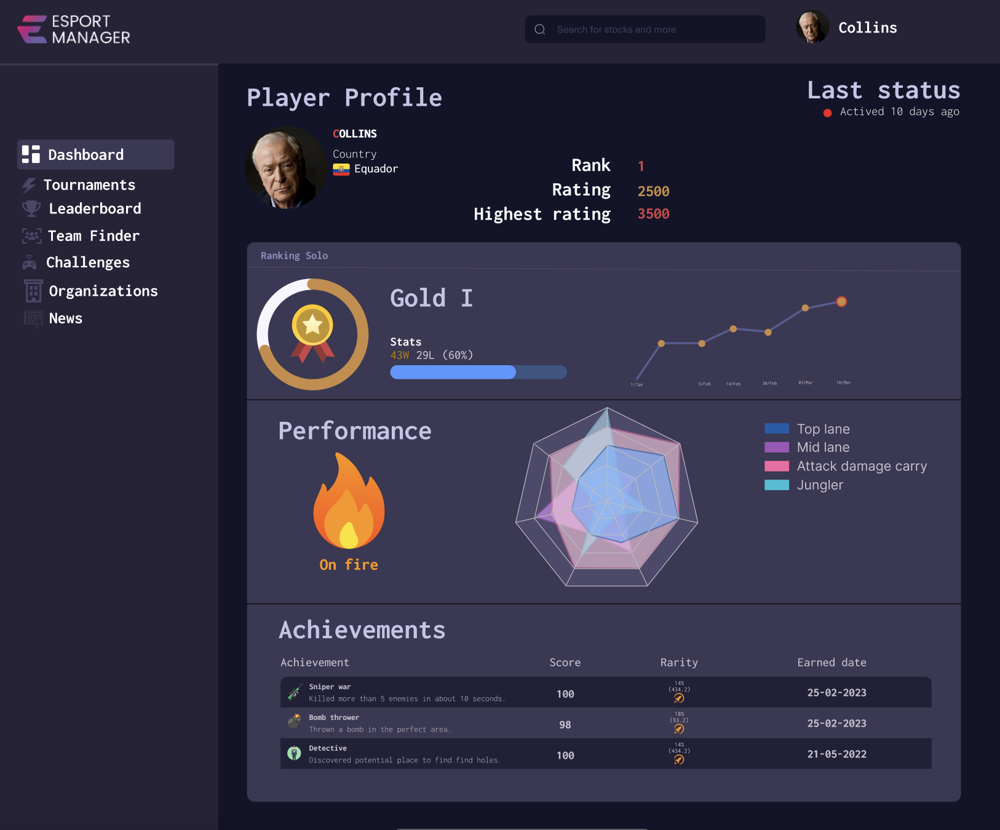
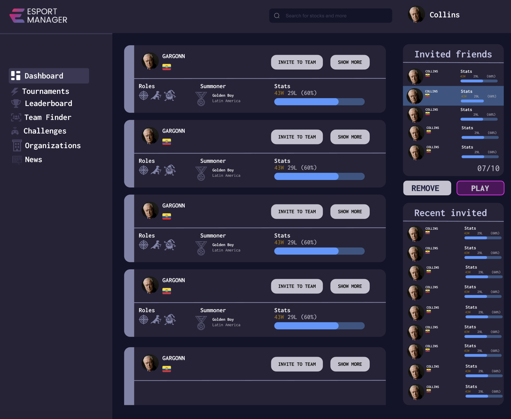
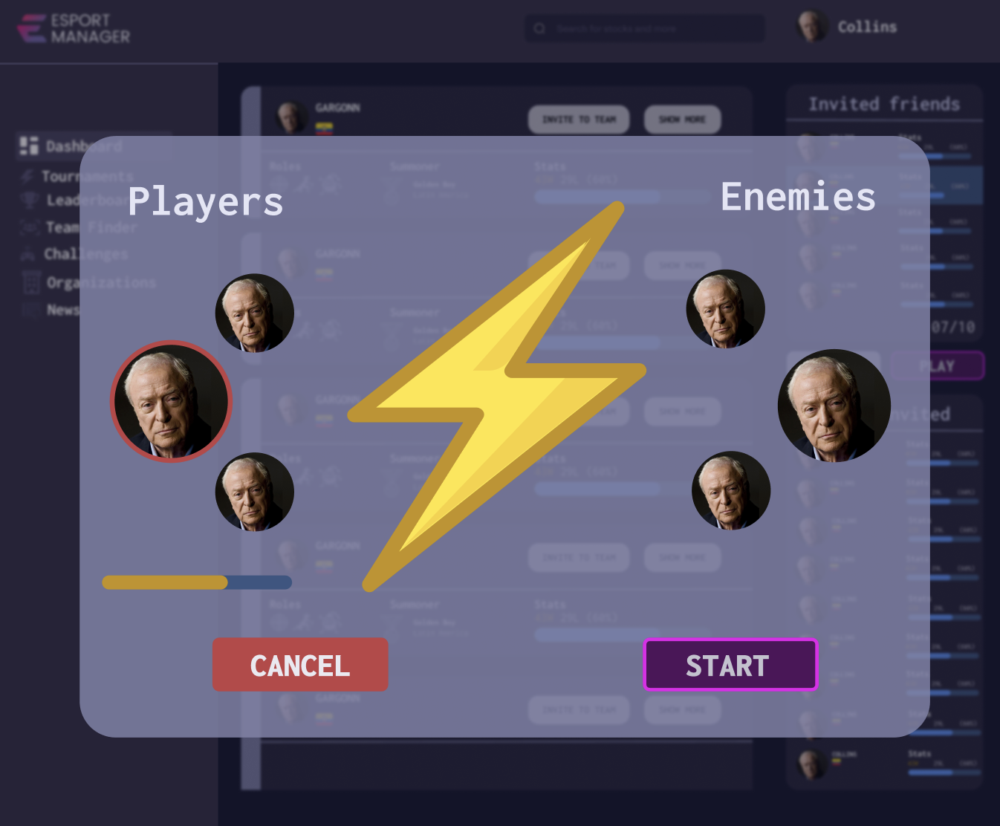
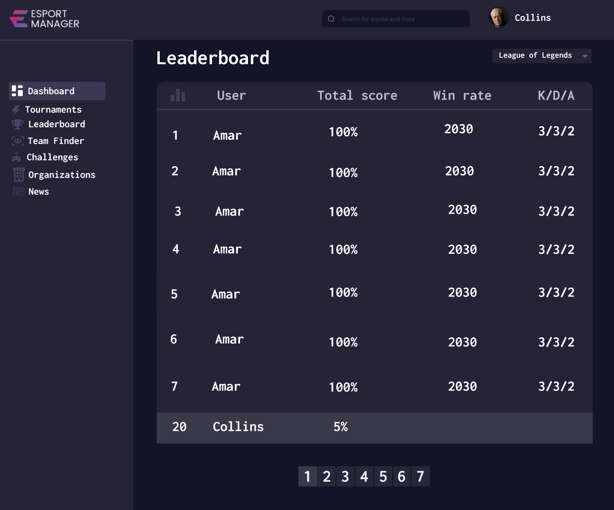

# Elo System - K&H HACK3 2023

## Synopsis
This project was prepared to solve the third challenge of "K&H Hack3" Hackathon " https://hack3.crafthub.events/Metaplayers%20challenge_1_K&H%20HACK3%20hackathon.pdf "

The aim is to develop a Leaderboard Elo system and a teammate/enemy finder based on in-game roles and performance.

## Table of contents

> * [Elo System - K&H HACK3 2023](#elo-system--h&h-hack3-2023)
>   * [Synopsis](#synopsis)
>   * [Table of contents](#table-of-contents)
>   * [Installation](#installation)
>   * [Usage](#usage)
>     * [Demo prototype](#demo-prototype)
>     * [Screenshots](#screenshots)
>     * [Features](#features)
>     * [Content](#content)
>     * [Requirements](#requirements)
>     * [Build](#build)
>     * [Deploy (how to install build product)](#deploy-how-to-install-build-product)
>   * [License](#license)

## Installation

Usage
========

## Demo Prototype

## Screenshots

## Challenge Description

This challenge has two little bit different parts but both of them are based on statistical
database analysis. The hackers should create an "ELO System" ranking each user depending on
their performance in each game that is available on esportmanager.com and has an API
connected to esportmanager.com. Right now this is PlayerUnknown's Battlegrounds, League of
Legends, Teamfight Tactics and Counter-Strike: Global Offensive. But the system's logic should be
implemented to other games also, that will be available on the platform.

Leaderboard Tournament based on statistics
Important to note that the tournament itself should not be developed. The main task is to
develop and create an ELO system and calculating method for the leaderboard.

With the use of the "ELO System'' we would like to create monthly/weekly/annual leaderboard
tournaments. The user joins the monthly/weekly/annual tournament and all they have to do is
play games as usual. The platform should track the users' all played games and statistics. Within
this 30 days the user plays as much as they want but only the 10 best games count in the
tournament. Based on these 10 games the total score is calculated, the first 16, 32, etc users are
rewarded. Regarding the scoring it depends on the game but usually the following statistics
count: win, kill count, death count (it counts as minus point), assists, farm, healing, damage dealt,
etc. These attributes should be changed for each game.

Creating the leaderboard for one game is a must (preferably it should be League of Legends) but
having more games is a plus (for example: CS:GO, PUBG, TFT).

Teammate/enemy finder based on in-game statistics a roles - queue and recommendation
Using the same "ELO System" and statistic database of the players' performance the platform
recommends teammates/duo partners play with or enemies to play against. For example it
considers the in-game rank, in-game role, character usage, etc and finds you the perfect partner
for a duo. These attributes should be changed for each game.

There should be a pool of players who want to participate in the "Finder Queue for Teammates"
or "Finder Queue for Enemies".

## License

[Apache License, Version 2.0](http://www.apache.org/licenses/LICENSE-2.0.html)