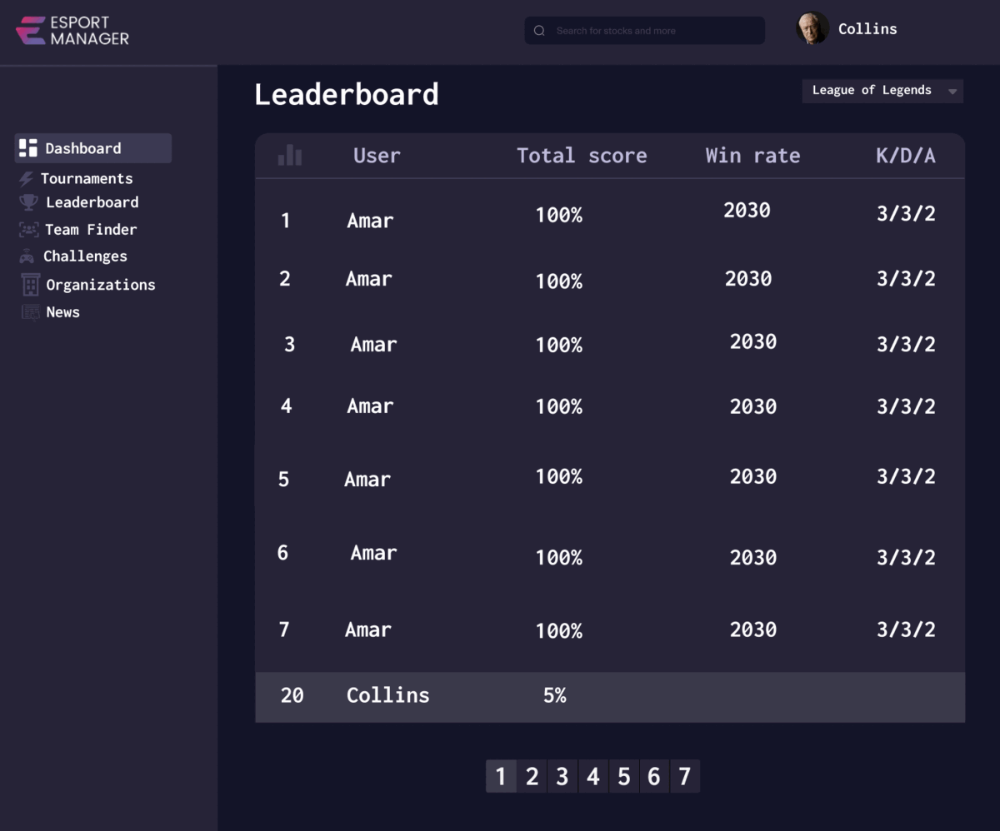

# Elo System - K&H HACK3 2023

## Synopsis
This project was prepared to solve the third challenge of "K&H Hack3" Hackathon " https://hack3.crafthub.events/Metaplayers%20challenge_1_K&H%20HACK3%20hackathon.pdf "

The aim is to develop a Leaderboard Elo system and a teammate/enemy finder based on in-game roles and performance.

## Table of contents

> * [Elo System - K&H HACK3 2023](#elo-system--h&h-hack3-2023)
>   * [Synopsis](#synopsis)
>   * [Table of contents](#table-of-contents)
>   * [Installation](#installation)
>   * [Usage](#usage)
>     * [Screenshots](#screenshots)
>     * [Features](#features)
>     * [Content](#content)
>     * [Requirements](#requirements)
>     * [Build](#build)
>     * [Deploy (how to install build product)](#deploy-how-to-install-build-product)
>   * [License](#license)

## Installation

Usage
========

## Demo Prototype

## License

[Apache License, Version 2.0](http://www.apache.org/licenses/LICENSE-2.0.html)